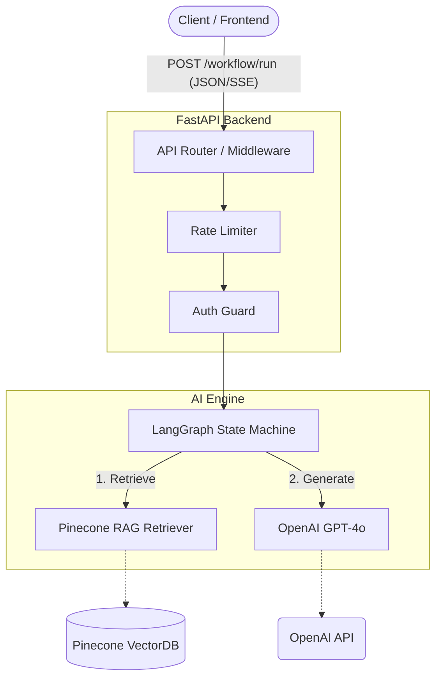

# 🚀 Enterprise GenAI Workflow Automation Platform

[](https://github.com/Lingikaushikreddy/genai-workflow-platform/actions/workflows/ci.yml)
[](https://www.python.org/)
[](https://fastapi.tiangolo.com)
[](https://www.docker.com/)
[](https://opensource.org/licenses/MIT)

> A production-grade Generative AI platform that automates complex business workflows using **LangGraph** agent orchestration and **Retrieval-Augmented Generation (RAG)**, served securely through an asynchronous **FastAPI** backend.

---

## 🌟 Key Features

- 🧠 **LangGraph Orchestration** — An async `retrieve → generate` state graph; a single compiled graph serves both standard request/response and real-time streaming modes.
- 🔍 **Advanced RAG** — Integrates **Pinecone** vector search to ground answers in your enterprise data. Every response explicitly returns the sources it utilized (`context_used`).
- ⚡ **Real-Time Token Streaming (SSE)** — `POST /api/v1/workflow/stream` emits the retrieved context immediately, followed by tokens as they generate, and concludes with a metadata `done` event.
- 📚 **End-to-End Document Ingestion** — `POST /api/v1/documents` chunks, embeds, and upserts documents automatically, closing the RAG loop entirely.
- 🛠️ **First-Class Mock Mode** — With no API keys configured, the platform dynamically falls back to LangChain's fake chat model and an in-memory vector store. **Every endpoint works offline** (ideal for CI and local development).
- 📊 **Enterprise Observability** — Structured JSON logging, `X-Request-ID` propagation, latency/model metadata tracking, and `/health/live` + `/health/ready` Kubernetes probes.
- 🔒 **Hardened Security Controls** — Features optional API-key authentication (`X-API-Key`), a strict request-body size cap (OOM guard), an in-process rate limiter, and a restrictive CORS policy.
- 🐳 **Production-Ready Deployment** — Multi-stage Docker image running as a non-root numeric UID. Kubernetes manifests included with resource limits, read-only root filesystems, and dropped capabilities.

---

## 🏗️ Architecture



## 🛠️ Technology Stack

| Layer | Technology |
|---|---|
| **API & Backend** | Python 3.11+, FastAPI, Uvicorn, Pydantic v2 |
| **Orchestration** | LangGraph, LangChain Core |
| **Models & Embeddings** | OpenAI (`gpt-4o`, `text-embedding-3-small`) |
| **Vector Database** | Pinecone (`langchain-pinecone`) |
| **Infrastructure** | Docker (Multi-stage), Kubernetes, GitHub Actions |

---

## 📁 Project Structure

```text
.
├── app/
│   ├── api/
│   │   ├── deps.py               # Dependency Injection Providers
│   │   └── routes/
│   │       ├── workflow.py       # POST /workflow/run, POST /workflow/stream (SSE)
│   │       ├── documents.py      # POST /documents (Ingestion)
│   │       └── health.py         # GET /health/live, GET /health/ready
│   ├── core/
│   │   ├── config.py             # Pydantic Settings
│   │   ├── exceptions.py         # Domain errors → API errors mapping
│   │   └── logging.py            # JSON logging + ContextVar
│   ├── models/
│   │   └── schemas.py            # I/O Schemas
│   ├── services/
│   │   ├── workflow.py           # LangGraph engine
│   │   └── ingestion.py          # Chunk → Embed → Upsert logic
│   ├── providers.py              # Dynamic Real/Mock LLM constructor
│   └── main.py                   # App factory & Middlewares
├── tests/                        # Offline Pytest suite (Mock Providers)
├── k8s/                          # Deployment & Service manifests
├── .github/workflows/ci.yml      # CI Pipeline (Lint + Test)
├── Dockerfile                    # Multi-stage, Non-root Image
└── requirements.txt
```

---

## 🚀 Quick Start (Local Development)

The platform requires Python 3.11+.

### 1. Installation

```bash
python3 -m venv .venv
source .venv/bin/activate
pip install -r requirements.txt -r requirements-dev.txt
```

### 2. Configuration (Optional)

Configure real providers. If omitted, the app gracefully degrades to **Mock Mode**.
```bash
cp .env.example .env
# Edit .env to add OPENAI_API_KEY and PINECONE_API_KEY
```

### 3. Run the Server

```bash
uvicorn app.main:app --reload
```
The API serves at `http://localhost:8000`. Interactive docs are available at [`/docs`](http://localhost:8000/docs).

> **💡 Note on Mock Mode:** If API keys are absent, the platform swaps in a fake chat model and an in-memory vector store pre-seeded with sample data. `/health/ready` reports which providers are active.

---

## 🔌 API Documentation

| Method | Route | Description |
|---|---|---|
| `POST` | `/api/v1/workflow/run` | Execute the RAG workflow. Returns answer, sources, and metadata. |
| `POST` | `/api/v1/workflow/stream` | Stream the workflow via Server-Sent Events (SSE). |
| `POST` | `/api/v1/documents` | Ingest documents (chunk → embed → upsert). |
| `GET` | `/health/live` | Kubernetes Liveness probe. |
| `GET` | `/health/ready` | Kubernetes Readiness probe + active provider report. |

### 🎯 Usage Examples

**1. Standard Run Workflow:**
```bash
curl -X POST localhost:8000/api/v1/workflow/run \
  -H 'Content-Type: application/json' \
  -d '{"query": "What does the platform do?"}'
```

**2. Stream Workflow (SSE):**
```bash
curl -N -X POST localhost:8000/api/v1/workflow/stream \
  -H 'Content-Type: application/json' \
  -d '{"query": "Summarize our ingestion guide"}'
```

---

## 🧪 Testing & CI

The suite runs fully offline (no API keys or network required):

```bash
pytest          # 29 tests: API, streaming (SSE), ingestion, errors, CORS, auth, limits, providers
ruff check .    # Linting
ruff format .   # Formatting
```

---

## 🐳 Docker & Kubernetes

**Docker Development:**
```bash
docker build -t enterprise-genai-backend .
docker run -p 8000:8000 --env-file .env enterprise-genai-backend
```

**Kubernetes Deployment:**
```bash
# 1. Create Secrets (Optional for Mock Mode)
kubectl create secret generic genai-secrets \
  --from-literal=openai-api-key="your-openai-key" \
  --from-literal=pinecone-api-key="your-pinecone-key" \
  --from-literal=api-key="your-gateway-api-key"

# 2. Deploy
kubectl apply -f k8s/deployment.yaml
kubectl apply -f k8s/service.yaml
```
*The K8s deployment includes liveness/readiness probes, resource limits, and a highly restrictive security context (`runAsNonRoot`, read-only root fs).*

---

## ⚙️ Configuration Reference

All settings are managed via environment variables (or `.env`):

| Variable | Default | Purpose |
|---|---|---|
| `OPENAI_API_KEY` | — | Enables the real LLM + embeddings (else falls back to mock) |
| `PINECONE_API_KEY` | — | Enables Pinecone (else falls back to in-memory store) |
| `PINECONE_INDEX_NAME` | `enterprise-knowledge` | Target Pinecone index |
| `BACKEND_CORS_ORIGINS`| `["http://localhost:3000"]` | Explicit CORS origins (`*` is rejected at startup) |
| `API_KEY` | — | If set, requires `X-API-Key` header on protected routes |
| `MAX_REQUEST_BYTES` | `16777216` | Max request body size (413 returned if exceeded) |
| `RATE_LIMIT_PER_MINUTE`| `0` | Per-client rate limit (`0` disables it) |
